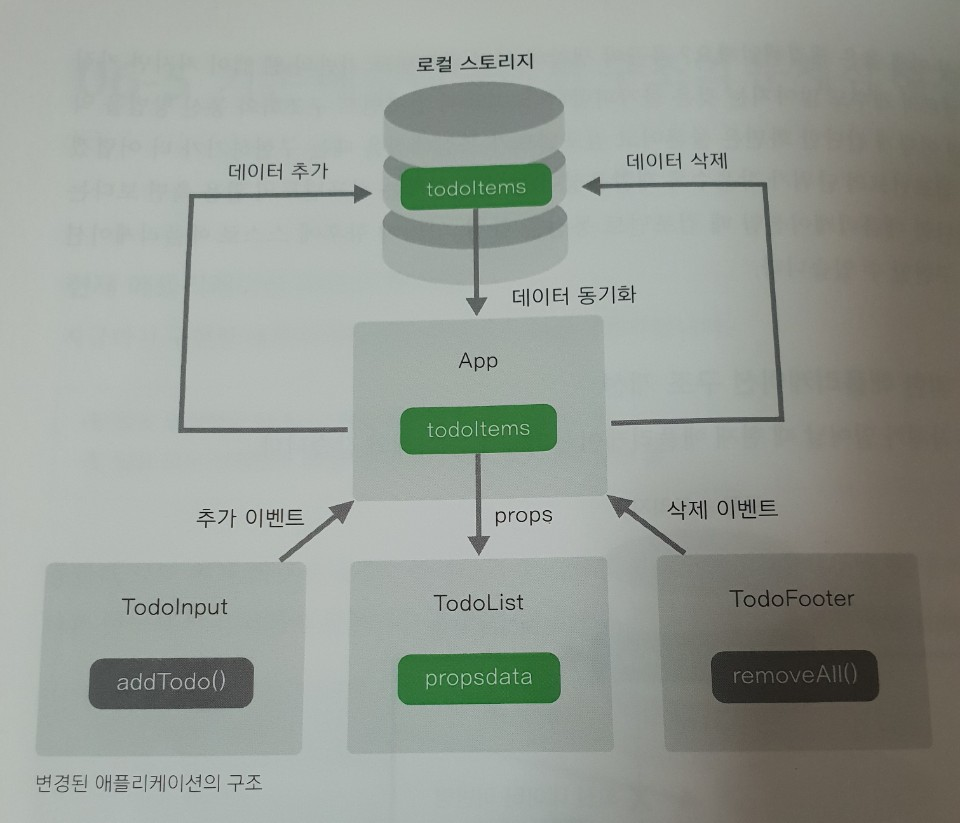

# 6장. 할일 관리 앱 만들기
### 애플리케이션 컴포넌트 구조도
- TodoHeader 영역
- TodoInput 영역
- TodoList 영역
- TodoFooter 영역

### 프로젝트 생성 및 구조 설정
- 프로젝트 생성
    - vue init webpack-simple
    - npm install하여 package.json 파일에 등록된 자바스크립트 라이브러리를 모두 다운로드
    - npm run dev 실행

- 컴포넌트 등록
    - 지역 컴포넌트 등록
    - 싱글파일 컴포넌트 체계에서는 특정 컴포넌트에서 다른 위치에 있는 컴포넌트의 내용을 불러올때 import 사용(웹스톰 스마트 자동완성으로 import 자동해줌)
    ```javascript
    // 컴포넌트 내용을 불러오기 위한 ES6 import 구문
    import 불러온 파일의 내용이 담길 객체 from '불러올 파일 위치'
  
    <script>
    import TodoHeader from "./components/TodoHeader";
    import TodoInput from "./components/TodoInput";
    import TodoList from "./components/TodoList";
    import TodoFooter from "./components/TodoFooter";
    
    export default {
      components: {
        'TodoHeader': TodoHeader,
        'TodoInput': TodoInput,
        'TodoList': TodoList,
        'TodoFooter': TodoFooter
      }
    }
    </script>
    ```
    - ES5와 차이점은 import 구문으로 컴포넌트의 내용을 불러와 담고 넘겨주느냐, var로 선언한 객체에 컴포넌트의 내용을 담아 넘겨 주느냐의 차이

### 컴포넌트 내용 구현
- 할일목록 갱신 문제
    - 할일 추가, 할일 모두 삭제시 로컬 스토리지에만 반영되고 화면은 브라우져를 새로고침해야 하는 문제
    - 화면에 보여주는 할일 목록 데이터는 TodoList컴포넌트에서 관리하고 있어서 
    - TodoInput(할일 추가), TodoFooter(할일 모두 삭제) 컴포넌트에서는 화면 갱신 불가
- 모든 컴포넌트가 같은 데이터를 조작한다면 매번 새로 고침해야하는 문제 해결
    - 최상위(루트) 컴포넌트인 App컴포넌트에 todoItems 데이터 정의, 하위 컴포넌트로 props속성, 이벤트 전달
    

    
### 더나은 사용자 경험 추가하기
- 뷰 애니메이션
    - 뷰 프레임워크 자체에서 지원하는 애니메이션 기능으로, 데이터추가, 삭제, 변경에 대한 fadeIn, fadeOut 등 여러가지 애니메이션 효과 지원
- 뷰 모달
    - 뷰에서 제공하는 팝업 대화상자
